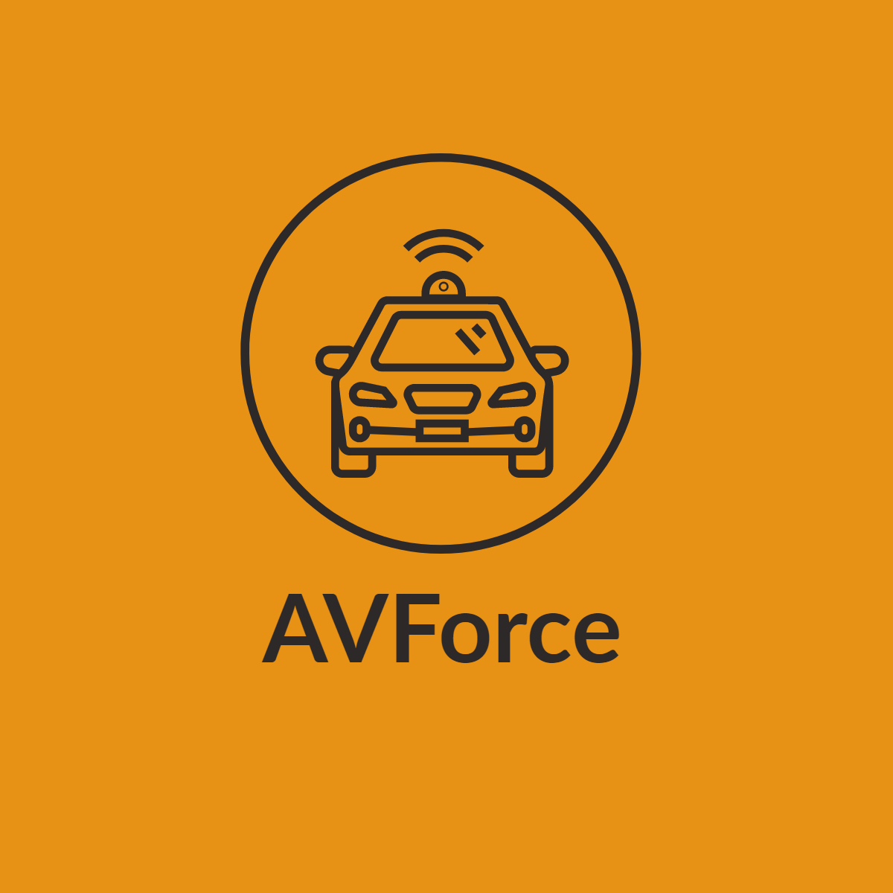
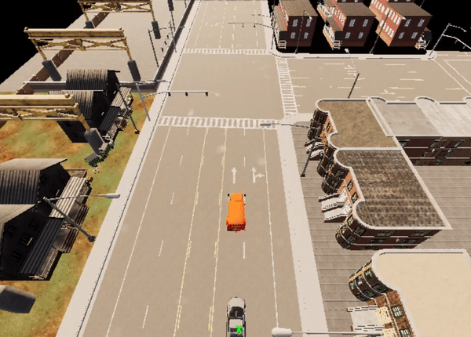
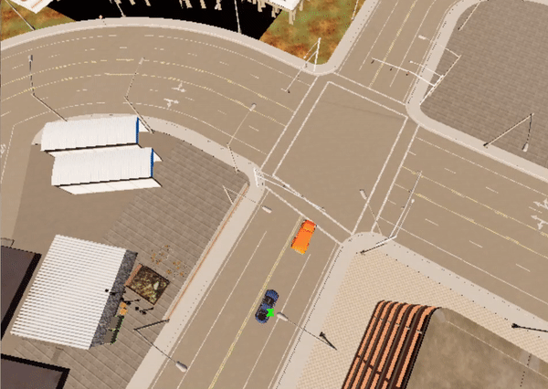

<p align="center">
  
</p>
The goal of this venture is to develop models capable of completing a variety of autonomous tasks within the Carla simulator using reinforcement learning methods.

# Chase
Autonomous chase of a fleeing vehicle.
This project followed a similar approach to learning. However, autonomous chasing proved to be more challenging than getting from point A to point B, and work on training a satisfactory model continues.

Examples of some fundamental chase manoeuvres:
<p align="left">
  
  
  
</p>

## Requirements
* Python 3.7.x
* Pipenv
* Git
* Carla 0.9.10

The pipfile contains a list of all essential project packages. For information on how to install these, see the [setup](#setup) section.
If you wish to use a GPU with Pytorch, you'll need a device that supports CUDA.

## Setup
1. Install git, python and pipenv
2. Clone this repository and navigate to its root directory
```bash
git clone https://github.com/AVForce/Chase
```
3. Install all required project packages by executing
```bash
pipenv install --dev
```

4. To open project virtual environment shell, type:
```bash
pipenv shell
```
## How to run?
1. Provide the paths to the Carla executable and egg files in the file *settings.py*,
2. Run *a2c_rgb.py* file.